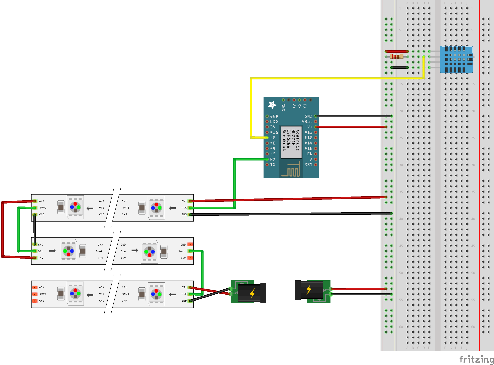

For my project in the Ubiquitous Computing course at KIT, I built a coffee table that doubles as a
display. Under a sheet of plexiglass sit 312 WS2812B LEDs in a 24 by 13 grid, which is hardly high
definition but more than enough for a clock and considerably more rainbows than anyone strictly
needs.

Its career as furniture got off to a poor start. My dorm room had no space for a table, so it ended
up on the wall above my couch, and there it found its actual purpose.
Set to brighten over thirty minutes, it became my wake-up light, and since light wakes me easily, I
had usually switched it off before the alarm got around to ringing.

Behind the effects, an ESP8266 drives all 312 LEDs as a single chain that snakes back and forth
across the rows, fed by a 5 V, 12 A power supply. The firmware began as someone else's example for
Blynk, a phone app for controlling microcontrollers, and grew from there as I added the clock, a
temperature reading from a DHT11 sensor, the effects and the wake-up routine, most of it written by myself.

The wiring diagram from the course, drawn with a different ESP8266 board than the NodeMCU in the
table.

Only after I moved into a shared flat did the table get to stand on its own legs, as the coffee table
in our living room. Over the following years I kept extending it, but the largest step forward came
from replacing my own firmware with WLED, an open-source project for ESP8266 and ESP32 boards whose
community maintains a large collection of effects and supports LED matrices out of the box. Writing
everything myself had taught me a lot, but it had also been a lot of work, and by comparison the
switch to WLED was almost embarrassingly easy.

It has since been replaced by a larger table that suits the room better, and it now waits in a dark
corner, an odd place to keep 312 LEDs, to be installed somewhere again.
